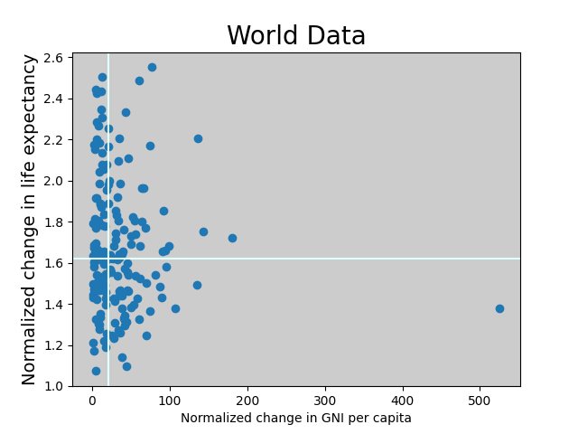
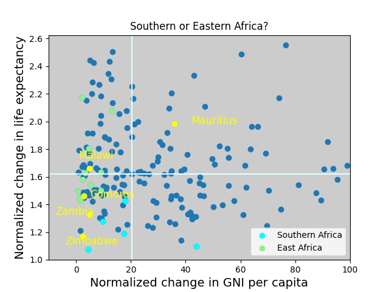

# Project 2: Exploratory Data Analysis of World Development Statistics
# Erin De Pree

## Problem Statement
We will look at each country's life expectancy and GNI per capita over time to determine under- and over-achievers in these categories.  Then we will use the data to attempt to determine the proper regional affliation for countries whose regional affliation varies by world leaders, UN, World Bank, etc.  Perhaps our data can help answer this question for some countries.

### Cautions
I will be using the term "country" to refer to the entities in this report with the understanding that not everyone agrees on this classification.  No official recognition or non-recognition is implied by an entity's inclusion or exclusion in this report.  The author lacks the necessary knowledge and training to make any informed statements in this matter.

## Data
There are three data sets in this report.  They are all from Gapminder and include a country's population, life expectancy, and gross national income (GNI) per capita.

### Population Data
This dataset is 197 entries (or countries) reporting populations in this country from 1800 to 2100.  Clearly at least the last 75 years are predictions from current data.  For this analysis, we will treat all points equally.  Looking at this dataset, all of the 100 missing datapoints are for the Holy See (or Vatican City).  Given the Holy See is a very differnt entity than the others (mostly administrative members of the Catholic Church and little to no native population), it will have a very different data and behavior of time than the other entities in this dataset.  We can safely drop the Holy See from our dataset without changing the overall behavior of the set.  

### Life Expectancy Data
The average amount of time someone born in this country can expect to live.  This has data from 195 countries over 301 years (1800 -- 2100).  There are 2079 missing datapoints (about 3.5% of the over all expected datapoints).  These data are from 9 countries who only have data from 1950 to 2019: Andorra, Dominica, St. Kitts and Nevis, Monaco, Marshall Islands, Nauru, Palau, San Marino, Tuvalu.  I dropped these countries from this analysis, there is a more detailed explanation in the technical report.

We conclude with life expectancy data from 1800 to 2100 for 186 countries.

### Gross National Income Per Capita Data
All 229 missing entries are from Liechtenstein.  There is data from 1988 to 2009.  Thus I am also dropping Liechtenstein from the dataset.  We end up with complete data for 190 countries from 1800 to 2050.  

## Analysis
Now the data is clean, we create a list of countries that are present in all three datasets: a total of 184 countries.  To compare between countries, I decided to look at a normalized change in variables.  A change from the beginning of the dataset to the end of the dataset and then normalized (or divided by) the initial value to account for each country having different starting values.  

$$ \text{normalized change} = \frac{ \langle \text{final value} \rangle - \langle \text{initial value} \rangle }{\langle \text{initial value} \rangle} $$

where the final value is averaged over the last twenty years of data and the initial data is averaged over the first twenty years of data.

###  Interesting combinations

Looking at the top and bottom 1/8 of both normalized life expectancy and normalized GNI per capita, there are some interesting results.  

| | Large GNI per capita gain (in top 12.5%) | Small GNI per capita gain (in bottom 12.5%) |
| ---| --- | --- |
| **Large life expectancy gain (top 12.5%)** | *Overperformers:* Singapore, Malta, Kuwait, South Korea | Uganda, Sierra Leone | 
| **Small life expectancy gain (bottom 12.5%)** | Norway, Cyprus | *Underperformers:* Central African Republic, Zimbabwe, Lesotho |

### Determining Regional Affiliation

For a wide varity reasons, there are several countries claimed by two or more regions at different time(s) and/or for different puposes (e.g. banking vs. aid).  Using normalized change in life expectancy and GNI per capita, we can classify some of these countries.  

#### Example: Comoros, Malawi, Mauritius, Zambia, and Zimbabwe

The countries definitely in either Southern Africa and East Africa are highlighted.  Looking at the groupings, it appears that Zambia and Zimbebwe are part of Southern Africa while Comoros and Malawi are part of east Africa.  Mauritius does not appear to belong to either group using this dataset.  

## Conclusion

We were able to indentify over- and under-performing countries as well as interesting combinations.  We were also able to identify regional affiliations for most of the countries with uncertain regional affiliations.  

